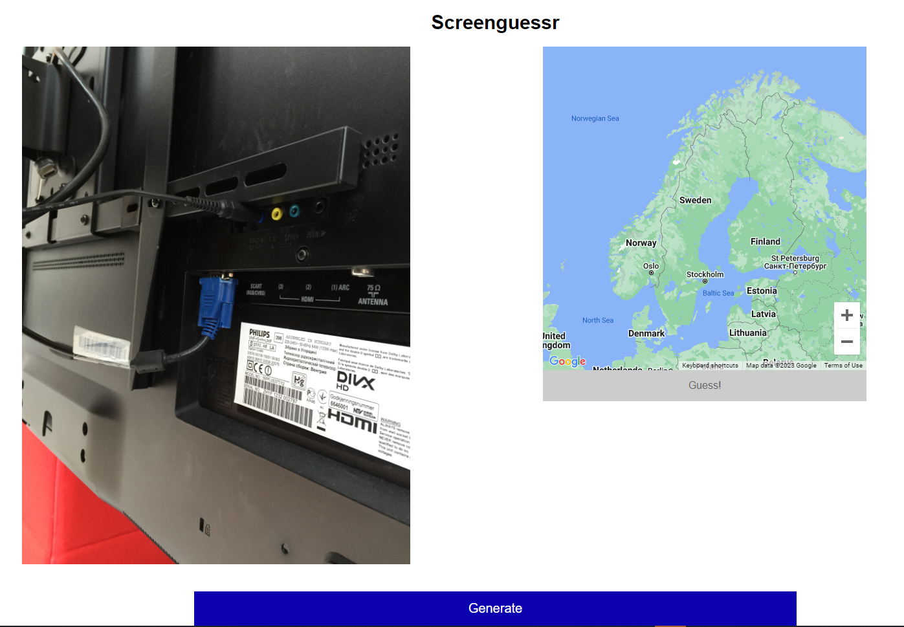

# Screenguessr

## Introduction
This is a simple game in the style of [Geoguessr](https://www.geoguessr.com/), but using static images instead of Google Street View.

The project consists of an Angular frontend and a Firebase backend. Currently the backend consists of a single Callable Function in the Google Cloud, which simply returns a random image. The database is just a static JSON file. The images are hosted in Google Cloud Storage.

(It was made in a single day, so don't expect too much.)

## Production
The project is deployed at https://screenguessr.web.app.

## Examples
This is an example of an image from the game:

